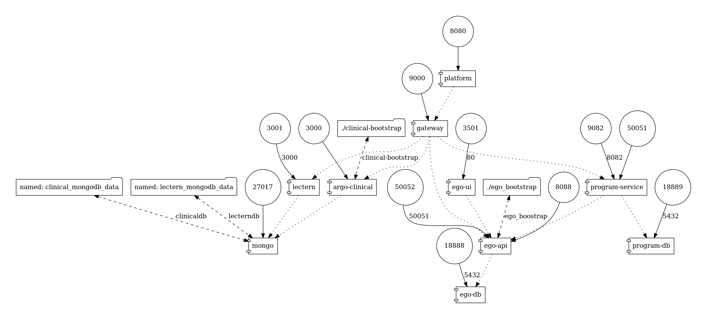

# ARGO Platform Docker Compose

This is the home of the Docker Compose infrastructure that can bring up the ARGO Platform architecture locally for aid in development.

## Compose Structure



## Requirements

- Docker
- Make

## User Guide

### Setup

0. Copy the .env.schema and fill in the google credentials

```bash
$ cp .env.schema .env
```

Please ensure that your google app has the correct Authorized redirect URI: `http://localhost:8088/api/oauth/login/google`

1. Start all the services in the background:

```bash
$ make start
```

2. Add yourself as an Ego admin as well as an administrator for program creation.

```bash
$ make add-admin EMAIL=<your_gmail_here>
```

### Stopping and Cleanup

To stop the running containers without deleting data:

```bash
$ make stop
```

To delete all volumes as well:

```bash
$ make nuke
```

### Interacting

- Ego Admin UI: http://localhost:3501
- ARGO Platform UI: http://localhost:8080
- Gateway:
  - Graphql: http://localhost:9000/graphql
  - other docs: http://localhost:9000/api-docs
- Clinical: http://localhost:3000/api-docs

## Development

- edit the `compose/docker-compose.yaml` file
- update compose diagram:
  ```
  $ make graph
  ```

## Architecture


